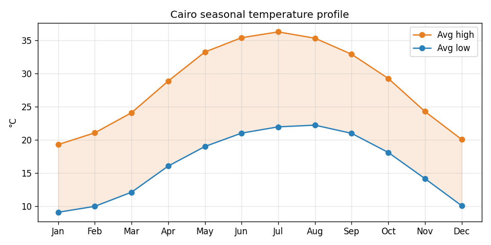

# Cairo Weather Trend Analysis

A "weather trend analysis" backlog item localized to my own city: a
pandas/matplotlib look at 5 years of Cairo daily temperatures — the
seasonal swing from mild winters to brutal summer highs, a yearly warming
trend, and how often summer actually crosses 40°C.



This sandbox has no outbound network access, so the dataset is a
synthetic-but-climate-realistic 5-year daily record (`generate_data.py`)
built from Cairo's real known seasonal averages — mild winters, brutal
dry summers, occasional July/August heatwaves — plus a small embedded
year-over-year warming drift and daily random noise, documented in the
generator itself rather than presented as scraped real data.

## Features

- Yearly warming trend via a simple linear fit over yearly average highs
  (`+0.03°C/year` on the generated data — small and noisy over just 5
  years, which is realistic: a real trend this size wouldn't be obvious
  without a much longer record either)
- Monthly seasonal climatology (average high/low per calendar month,
  across all years) — Cairo's "typical year" shape
- Heatwave-day counts per year (days over a configurable °C threshold,
  default 40°C)
- Hottest/coldest month lookup
- Two charts: the yearly trend line and the seasonal high/low profile
  with the daily range shaded between them

## Tech Stack

Python 3 · pandas · NumPy · matplotlib

## Getting Started

```bash
git clone https://github.com/Kazenubis/cairo-weather-trends.git
cd cairo-weather-trends
pip install -r requirements.txt
python3 weather_analysis.py --trend --seasonal --heatwaves --chart assets
```

Regenerate the dataset (it's seeded, so this is reproducible):

```bash
python3 generate_data.py
```

Run the tests:

```bash
python3 -m unittest test_weather_analysis.py -v
```

## What I Learned

`monthly_climatology`'s `.reindex(range(1, 13))` mattered more than it
looked: without it, a month with genuinely no rows in the data (possible
on a smaller or filtered dataset) silently disappears from the result
instead of showing up as a clear gap — which would make "hottest/coldest
month" wrong in a way that's easy to miss, since the code would just skip
straight to the next real value. Reindexing against the full 1–12 range
and testing the missing-month case directly
(`test_climatology_only_has_rows_for_months_present_in_data`) makes that
failure mode visible (`NaN`) instead of silent.
